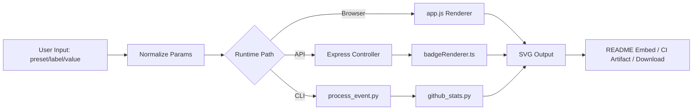

# Badge Forge — SVG Custom Badge Generator

A zero-backend, production-ready badge generation toolkit for README-driven observability, release tracking, and developer workflow telemetry.

[](https://readme-svg-custom-badge-generator.vercel.app)
[](https://www.python.org/)
[](https://pypi.org/project/Flask/)
[](LICENSE)
[](#features)

> [!NOTE]
> This repository provides a browser-first badge generator, a TypeScript HTTP service, and Python tooling. There is no mandatory always-on backend for core usage.

# Example

<p align="center">
  
  
  
  
  
  
  
  
  
</p>

---

## Table of Contents
- [Features](#features)
- [Tech Stack & Architecture](#tech-stack--architecture)
  - [Core Stack](#core-stack)
  - [Project Structure](#project-structure)
  - [Key Design Decisions](#key-design-decisions)
- [Getting Started](#getting-started)
  - [Prerequisites](#prerequisites)
  - [Installation](#installation)
- [Testing](#testing)
- [Deployment](#deployment)
- [Usage](#usage)
  - [Basic Usage](#basic-usage)
- [Configuration](#configuration)
- [License](#license)
- [Support the Project](#support-the-project)

## Features

- Deterministic SVG rendering across JavaScript (`app.js`), TypeScript server (`server/services/badgeRenderer.ts`), and Python (`api/github_stats.py`).
- Multiple rendering profiles (`flat`, `flat-square`, `for-the-badge`, `plastic`, `social`, `rounded`, `pill`, `outline`, `soft`).
- Theme-aware palette model with overridable segment and text colors.
- Preset system optimized for common operational and release telemetry (`build`, `coverage`, `release`, `docs`, `quality`).
- Built-in icon registry plus custom icon upload/data URI support.
- Shields.io-compatible path endpoint (`/badge/<label>-<value>`) for URL-based embedding workflows.
- Query-based endpoint with rich parameterization (`/badge?...`) for runtime badge synthesis.
- Safe defaults and input guards (hex color validation, bounded scaling, icon payload limits).
- Optional gradient overlays, uppercase rendering, compact mode, and rounded geometry control.
- Static frontend delivery compatible with Vercel, plus optional Express service for API workflows.
- Local CLI utility (`process_event.py`) for scripted generation in CI/CD.
- Sample artifact regeneration workflow for reproducible visual baselines.

> [!TIP]
> Use the web app for interactive badge design, then promote stable output into versioned SVG artifacts in your repository.

## Tech Stack & Architecture

### Core Stack

- `JavaScript` + `HTML` + `CSS` for the browser rendering surface.
- `TypeScript` + `Express` for optional HTTP badge generation APIs.
- `Python 3.10+` for CLI and script-driven SVG generation.
- `Vercel` for static hosting/deployment.
- `GitHub Actions` for repository automation workflows.

### Project Structure

<details>
<summary>Expand file tree</summary>

```text
.
├── api/
│   ├── badge.js
│   ├── data_fetchers.py
│   └── github_stats.py
├── scripts/
│   └── refresh_sample_svgs.py
├── sample_svgs/
│   ├── sample_build.svg
│   ├── sample_coverage.svg
│   ├── sample_docs.svg
│   ├── sample_quality.svg
│   └── sample_release.svg
├── server/
│   ├── controllers/
│   │   └── badgeController.ts
│   ├── routes/
│   │   └── routes.ts
│   ├── services/
│   │   ├── badgeRenderer.ts
│   │   └── iconService.ts
│   ├── index.ts
│   ├── package.json
│   └── tsconfig.json
├── trigger action/
│   └── trigger_action.py
├── app.js
├── index.html
├── process_event.py
├── requirements.txt
├── styles.css
├── vercel.json
└── README.md
```

</details>

### Key Design Decisions

1. **Renderer parity over single-language lock-in**
   - Rendering logic is intentionally mirrored between browser JS, server TS, and Python to keep output stable across usage modes.
2. **Static-first default architecture**
   - Core user workflow requires only static assets; backend services are additive, not mandatory.
3. **Composable style system**
   - Style profile + theme palette + runtime overrides provide extensibility without engine rewrites.
4. **Operational safety controls**
   - Input constraints and icon payload limits reduce rendering abuse and oversized SVG outputs.



<details>
<summary>Architecture deep-dive: endpoint behavior and request lifecycle</summary>

- `GET /badge`: Consumes query parameters and returns `image/svg+xml`.
- `GET /badge/*`: Parses path format (`label-value`) and delegates to the same generation pipeline.
- `GET /list.json`: Returns runtime catalog (icons, styles, themes, sizes, presets).
- `POST /icon`: Registers custom icon payloads with request-rate limiting and size guards.
- GET responses are emitted with short caching headers (`max-age=300`) for predictable refresh behavior.

</details>

> [!IMPORTANT]
> For reproducibility, prefer pinned presets and checked-in SVG files over purely dynamic badge URLs.

## Getting Started

### Prerequisites

- `Node.js >= 18` (for TypeScript server mode).
- `npm` (for server dependencies/build).
- `Python >= 3.10` + `pip` (for CLI and script workflows).
- Modern browser for interactive UI usage.

### Installation

```bash
git clone https://github.com/OstinFCT/readme-SVG-custom-badge-generator.git
cd readme-SVG-custom-badge-generator
```

Install Python dependencies (optional but recommended):

```bash
python -m venv .venv
source .venv/bin/activate  # Windows: .venv\Scripts\activate
pip install -r requirements.txt
```

Install server dependencies (optional API mode):

```bash
cd server
npm install
cd ..
```

Run static UI locally:

```bash
python -m http.server 8080
```

Open `http://localhost:8080`.

<details>
<summary>Troubleshooting and alternative setup paths</summary>

- If `python` resolves to Python 2, use `python3`.
- If `npm install` fails due to engine mismatch, verify `node -v` is `18+`.
- To run server mode in development:
  ```bash
  cd server
  npm run dev
  ```
- To run production server build:
  ```bash
  cd server
  npm run build
  npm start
  ```

</details>

## Testing

Run deterministic checks locally:

```bash
python -m py_compile api/github_stats.py api/data_fetchers.py process_event.py scripts/refresh_sample_svgs.py
python scripts/refresh_sample_svgs.py
python process_event.py --label build --value passing --style flat --theme terminal --output badge-smoke.svg
```

Run server build validation:

```bash
cd server
npm run build
cd ..
```

Optional style/lint checks:

```bash
black .
flake8 .
```

> [!WARNING]
> A full unit/integration test suite is not yet present; current validation is generation-oriented and compile/build oriented.

## Deployment

### Static Deployment (Recommended)

Use Vercel to publish the frontend artifact directly:

```bash
vercel
vercel --prod
```

### Server Deployment (Optional)

```bash
cd server
npm install
npm run build
npm start
```

Expose port `5000` (or set `PORT`) in your runtime environment.

### CI/CD Integration Guidance

- Add a Python compile + sample regeneration stage.
- Add TypeScript build checks for server integrity.
- Enforce clean working tree after artifact generation (`git diff --exit-code`).

> [!CAUTION]
> Dynamic badge endpoints are cacheable and externally consumable; review rate-limits and payload controls before public exposure.

## Usage

### Basic Usage

Generate a badge through the HTTP API:

```bash
curl "http://localhost:5000/badge?label=logging&value=healthy&style=flat&theme=terminal" -o logging-health.svg
```

Generate a badge through CLI:

```bash
python process_event.py \
  --label "logging" \
  --value "stable" \
  --icon "check" \
  --style "for-the-badge" \
  --theme "terminal" \
  --gradient \
  --output "logging-status.svg"
```

Embed in GitHub Markdown:

```markdown

```

<details>
<summary>Advanced Usage: query parameters, custom formatters, and edge cases</summary>

### Query-driven customization

```bash
curl "http://localhost:5000/badge?label=logs&value=ingest%20ok&icon=rocket&style=pill&theme=neon&size=lg&uppercase=1&compact=1"
```

### Path format for Shields-style URLs

```bash
curl "http://localhost:5000/badge/logs-ingest__ok?style=flat-square&theme=dark"
```

### JavaScript integration example

```js
const svg = generateBadge({
  label: 'logging',
  value: 'rate limited',
  style: 'outline',
  theme: 'dark',
  borderColor: '#ef4444',
  compact: true,
});

console.log(svg);
```

### Edge-case guidance

- Keep label/value strings concise to avoid oversized visual output.
- Use hex colors only (`#RRGGBB`) for reliable fallback behavior.
- For custom icons, validate MIME and keep base64 payloads small.

</details>

## Configuration

Runtime controls can be applied via query params, CLI flags, and optional environment variables.

### Environment Variables

| Variable | Required | Scope | Purpose | Example |
|---|---|---|---|---|
| `PORT` | No | Server | Express listen port | `5000` |
| `PYTHONPATH` | No | Tooling | Import path extension for scripts | `./api` |

### Startup Flags (`process_event.py`)

| Flag | Type | Default | Description |
|---|---|---|---|
| `--label` | string | `build` | Left segment text |
| `--value` | string | `passing` | Right segment text |
| `--icon` | string | `check` | Icon key |
| `--style` | string | `flat` | Style profile |
| `--theme` | string | `dark` | Palette theme |
| `--output` | path | `badge.svg` | Output file |
| `--uppercase` | flag | `false` | Force uppercase output |
| `--compact` | flag | `false` | Condensed width layout |
| `--gradient` | flag | `false` | Gradient overlay |

<details>
<summary>Exhaustive HTTP configuration matrix</summary>

| Parameter | Type | Default | Allowed Values / Constraints | Notes |
|---|---|---|---|---|
| `preset` | string | none | `build`, `coverage`, `release`, `docs`, `quality` | Seeds baseline values |
| `label` | string | `build` | max ~40 chars | Left segment content |
| `value` | string | `passing` | max ~52 chars | Right segment content |
| `icon` | string | `none` | Built-in key or custom slug | Resolved via icon service |
| `iconData` | string | none | data URI, size-limited | Prefer validated payloads |
| `style` | string | `flat` | profile keys in renderer | Impacts height, radius, weight |
| `theme` | string | `dark` | theme keys in renderer | Provides fallback palette |
| `size` | string | `md` | `xs`,`sm`,`md`,`lg`,`xl` | Base scale multiplier |
| `scale` | float | `1.0` | clamped `0.7..2.0` | Additional width/height scaling |
| `labelBg` | hex color | theme-derived | `#RRGGBB` | Left background override |
| `valueBg` | hex color | theme-derived | `#RRGGBB` | Right background override |
| `labelColor` | hex color | theme-derived | `#RRGGBB` | Left text override |
| `valueColor` | hex color | theme-derived | `#RRGGBB` | Right text override |
| `borderColor` | hex color | theme-derived | `#RRGGBB` | Used by bordered styles |
| `borderRadius` | int | style-defined | clamped `0..999` | Optional custom radius |
| `gradient` | bool | `false` | `1/true` or `0/false` | Adds glossy overlay |
| `uppercase` | bool | `false` | `1/true` or `0/false` | Forces upper-case text |
| `compact` | bool | `false` | `1/true` or `0/false` | Reduces padding footprint |

</details>

## License

This project is licensed under the MIT License. See [`LICENSE`](LICENSE) for complete terms.

## Support the Project

[](https://www.patreon.com/OstinFCT)
[](https://ko-fi.com/fctostin)
[](https://boosty.to/ostinfct)
[](https://www.youtube.com/@FCT-Ostin)
[](https://t.me/FCTostin)

If you find this tool useful, consider leaving a star on GitHub or supporting the author directly.
