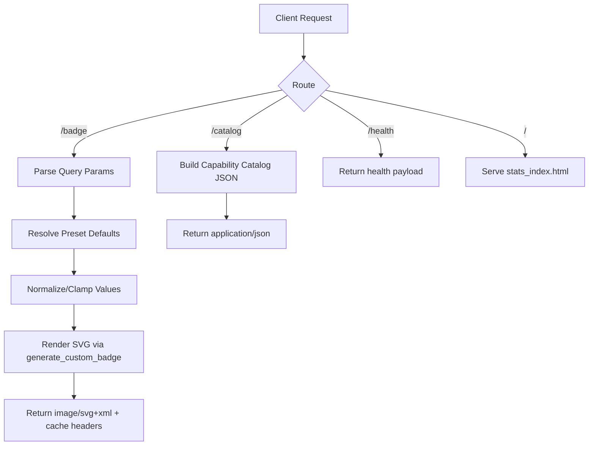

# README SVG Custom Badge Generator

A production-ready Python/Flask badge rendering service for generating highly customizable SVG badges for GitHub READMEs, profiles, and technical documentation.

[](https://www.python.org/)
[](https://flask.palletsprojects.com/)
[](https://vercel.com/)
[](LICENSE)

> [!NOTE]
> This project is an HTTP-based SVG badge generator service (not a traditional logging SDK), but it is suitable for visualizing logging/observability states (for example: `logs=healthy`, `alerts=0`, `error-rate=low`) directly in documentation.

## Table of Contents

- [Title and Description](#readme-svg-custom-badge-generator)
- [Table of Contents](#table-of-contents)
- [Features](#features)
- [Tech Stack \\& Architecture](#tech-stack--architecture)
- [Getting Started](#getting-started)
- [Testing](#testing)
- [Deployment](#deployment)
- [Usage](#usage)
- [Configuration](#configuration)
- [License](#license)
- [Support the Project](#support-the-project)

## Features

- Serverless-friendly SVG badge rendering through a lightweight Flask application.
- Main badge endpoint `GET /badge` with granular query-parameter customization.
- Rich style support:
  - `flat`, `flat-square`, `for-the-badge`, `plastic`, `social`, `rounded`, `pill`, `outline`, `soft`.
- Theme system with predefined palettes:
  - `dark`, `light`, `neon`, `sunset`, `terminal`.
- Built-in size system (`xs`, `sm`, `md`, `lg`, `xl`) plus continuous scaling via `scale`.
- Optional icon prefixes (`star`, `heart`, `check`, `fire`, `bolt`, `rocket`, `code`, `build`, `docs`, `none`).
- Advanced visual tuning:
  - independent left/right backgrounds,
  - independent label/value text colors,
  - custom border color,
  - border radius control,
  - uppercase transform,
  - compact mode,
  - optional plastic gradient overlay.
- Preset-based fast generation for common scenarios (`build`, `coverage`, `release`, `docs`, `quality`).
- Catalog endpoint `GET /catalog` exposing supported themes, styles, sizes, icons, palette, and presets for UI/CLI integration.
- Health endpoint `GET /health` for uptime probes and deployment smoke checks.
- Browser playground entrypoint on `GET /` powered by `stats_index.html`.
- CORS-enabled responses and short-term cache headers for CDN friendliness.
- Sample SVG generation script for documentation assets and regression snapshots.

## Tech Stack & Architecture

### Core Stack

- Language: Python 3.11+
- Web framework: Flask `3.1.3`
- Runtime model: Stateless HTTP handlers (Vercel-compatible)
- Configuration/dependency support: `python-dotenv` (available in dependencies)
- Output format: Pure SVG (`image/svg+xml`)

### Project Structure

```text
.
├── api/
│   ├── data_fetchers.py          # Catalog and preset resolution
│   ├── github_stats.py           # Badge rendering engine (styles, themes, SVG composition)
│   └── stats_index.py            # Flask app routes: /, /badge, /catalog, /health
├── scripts/
│   └── refresh_sample_svgs.py    # Rebuild sample SVG artifacts
├── sample_*.svg/                 # Generated sample badge outputs
├── stats_index.html              # Interactive playground UI
├── requirements.txt              # Python dependencies
├── vercel.json                   # Vercel build and route mapping
├── LICENSE
└── README.md
```

### Key Design Decisions

- **Function-centric rendering pipeline**: `generate_custom_badge(...)` centralizes SVG construction and input normalization in one deterministic call.
- **Serverless routing model**: A single Flask module (`api/stats_index.py`) is used as the Vercel function target and route dispatcher.
- **Defensive parameter parsing**: Numeric and boolean query parameters are clamped/coerced to safe ranges to avoid malformed SVG output.
- **Preset-first UX**: Presets reduce query complexity while still allowing full override through explicit parameters.
- **Theme + override strategy**: Baseline theme colors are merged with optional explicit colors for precision control.



> [!IMPORTANT]
> The service is stateless and file-system independent at request time, which makes it safe to scale horizontally behind serverless or container platforms.

## Getting Started

### Prerequisites

- Python `3.11` or newer
- `pip` (bundled with modern Python)
- Git
- Optional: Vercel CLI (`npm i -g vercel`) for cloud deployment

### Installation

```bash
git clone https://github.com/<your-user>/readme-SVG-custom-badge-generator.git
cd readme-SVG-custom-badge-generator
python -m venv .venv
source .venv/bin/activate
pip install -r requirements.txt
python api/stats_index.py
```

Open `http://127.0.0.1:5000` to access the playground and API locally.

> [!TIP]
> If you are using Windows PowerShell, activate the virtual environment with `\.venv\Scripts\Activate.ps1`.

## Testing

This repository currently focuses on runtime validation and smoke checks rather than a full formal unit/integration test suite.

### Unit-Level and Syntax Validation

```bash
python -m compileall api scripts
```

### Integration and Endpoint Smoke Tests

Start the app first:

```bash
python api/stats_index.py
```

Then run:

```bash
curl -sS "http://127.0.0.1:5000/health"
curl -sS "http://127.0.0.1:5000/catalog" | python -m json.tool
curl -sS "http://127.0.0.1:5000/badge?label=logs&value=healthy&icon=check&theme=terminal&style=flat" -o /tmp/logging-badge.svg
```

### Linting and Static Checks (Recommended)

```bash
python -m pip install ruff
ruff check .
```

> [!WARNING]
> There is no built-in CI test matrix in this repository yet. If you adopt this project in production, wire these commands into your CI pipeline immediately.

## Deployment

### Vercel Deployment (Recommended)

`vercel.json` maps both root and API routes to `api/stats_index.py`.

```bash
npm i -g vercel
vercel
```

For production promote:

```bash
vercel --prod
```

### Containerized Deployment (Alternative)

You can containerize the Flask app using a minimal Python image and expose port `5000`.

Example runtime command:

```bash
python api/stats_index.py
```

### CI/CD Integration Guidance

- Run syntax + lint checks on every pull request.
- Run endpoint smoke checks against a temporary preview environment.
- Publish preview links and validate `/health` before promotion.

> [!CAUTION]
> Do not rely solely on visual badge rendering for production health status. Keep observability alerts and SLO checks in your monitoring stack.

## Usage

### Basic Badge Request

```markdown

```

### Logging/Observability-Oriented Badge Example

```markdown

```

### Richly Customized Badge

```text
/badge?
  label=error-rate&
  value=0.02%&
  icon=bolt&
  style=plastic&
  theme=neon&
  size=xl&
  scale=1.10&
  border_radius=12&
  gradient=true&
  compact=false&
  label_bg=%23111827&
  value_bg=%230f172a&
  label_color=%23e2e8f0&
  value_color=%2386efac&
  border_color=%23334155
```

### Python Integration Snippet

```python
import requests

BASE_URL = "https://your-domain.vercel.app"

params = {
    "label": "logs",
    "value": "healthy",
    "icon": "check",
    "theme": "terminal",
    "style": "flat",
    "size": "md",
}

response = requests.get(f"{BASE_URL}/badge", params=params, timeout=10)
response.raise_for_status()  # Fail fast on non-200 responses.

with open("logs-badge.svg", "wb") as file:
    file.write(response.content)  # Save generated SVG artifact.
```

## Configuration

### API Endpoints

- `GET /` — Serves interactive HTML playground.
- `GET /badge` — Generates SVG badge output.
- `GET /catalog` — Returns JSON catalog of supported options.
- `GET /health` — Returns service health payload.

### `/badge` Query Parameters

| Parameter | Type | Default | Description |
| --- | --- | --- | --- |
| `preset` | string | `build` preset | `build`, `coverage`, `release`, `docs`, `quality` |
| `label` | string | preset-specific | Left badge text |
| `value` | string | preset-specific | Right badge text |
| `icon` | string | preset-specific | `star`, `heart`, `check`, `fire`, `bolt`, `rocket`, `code`, `build`, `docs`, `none` |
| `style` | string | preset-specific | `flat`, `flat-square`, `for-the-badge`, `plastic`, `social`, `rounded`, `pill`, `outline`, `soft` |
| `theme` | string | preset-specific | `dark`, `light`, `neon`, `sunset`, `terminal` |
| `size` | string | `md` | `xs`, `sm`, `md`, `lg`, `xl` |
| `scale` | float | `1.0` | Clamp range: `0.7..2.0` |
| `label_bg` | hex color | theme default | Left segment background (`#RRGGBB`) |
| `value_bg` | hex color | theme default | Right segment background (`#RRGGBB`) |
| `label_color` | hex color | theme default | Left segment text color (`#RRGGBB`) |
| `value_color` | hex color | theme default | Right segment text color (`#RRGGBB`) |
| `border_color` | hex color | theme default | Border color (`#RRGGBB`) |
| `border_radius` | int | `4` | Clamp range: `0..999` |
| `gradient` | bool | `false` | Plastic-style gradient overlay |
| `uppercase` | bool | `false` | Forces uppercase label/value text |
| `compact` | bool | `false` | Tightens sizing and spacing |

### Environment Variables

This project can run without mandatory environment variables for local usage.

Commonly used runtime variables in production environments:

- `PORT` (platform-defined): If your host injects a port, adapt Flask startup wrapper accordingly.
- `PYTHONUNBUFFERED=1`: Improves log streaming behavior in containers.
- `FLASK_ENV=production`: Explicit production runtime mode.

### Configuration Files

- `requirements.txt` — Python dependency lock surface.
- `vercel.json` — Build target and route mapping for serverless deployment.

## License

This project is licensed under the GNU General Public License v3.0 (GPL-3.0). See [LICENSE](LICENSE) for full legal terms.

## Support the Project

[](https://www.patreon.com/OstinFCT)
[](https://ko-fi.com/fctostin)
[](https://boosty.to/ostinfct)
[](https://www.youtube.com/@FCT-Ostin)
[](https://t.me/FCTostin)

If you find this tool useful, consider leaving a star on GitHub or supporting the author directly.
