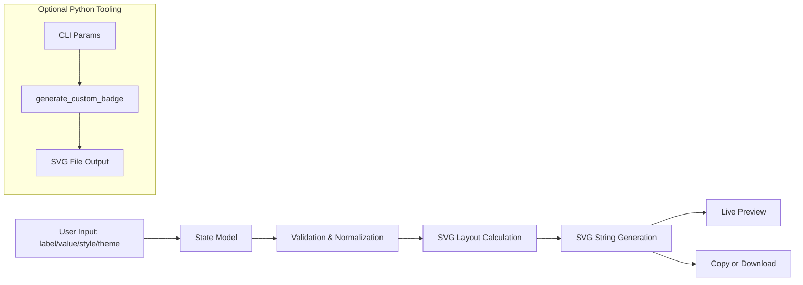
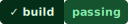

# Badge Forge — SVG Custom Badge Generator

A zero-backend, production-ready badge generation toolkit for README-driven observability, release tracking, and developer workflow telemetry.

[](https://readme-svg-custom-badge-generator.vercel.app)
[](https://www.python.org/)
[](https://pypi.org/project/Flask/)
[](LICENSE)
[](#features)

> [!NOTE]
> Although this repository includes Python rendering modules, the primary product experience is now fully client-side and suitable for static hosting.

## Table of Contents

- [Badge Forge — SVG Custom Badge Generator](#badge-forge--svg-custom-badge-generator)
- [Table of Contents](#table-of-contents)
- [Features](#features)
- [Tech Stack & Architecture](#tech-stack--architecture)
  - [Core Stack](#core-stack)
  - [Project Structure](#project-structure)
  - [Key Design Decisions](#key-design-decisions)
- [Getting Started](#getting-started)
  - [Prerequisites](#prerequisites)
  - [Installation](#installation)
- [Testing](#testing)
- [Deployment](#deployment)
- [Usage](#usage)
  - [Web UI (recommended)](#web-ui-recommended)
  - [Python CLI](#python-cli)
  - [README Embedding Example](#readme-embedding-example)
- [Configuration](#configuration)
  - [Environment Variables](#environment-variables)
  - [CLI Flags](#cli-flags)
  - [Badge Rendering Parameters](#badge-rendering-parameters)
- [License](#license)
- [Support the Project](#support-the-project)

## Features

- Zero-server SVG badge generation workflow (browser-first architecture).
- Interactive badge editor with real-time rendering preview.
- Built-in presets for common pipeline signals: `build`, `coverage`, `release`, `docs`, `quality`.
- Rich style system with multiple profiles (`flat`, `plastic`, `for-the-badge`, `pill`, etc.).
- Theme and palette support for controlled visual consistency.
- Optional uppercase, compact mode, and gradient overlay.
- Icon rendering support with built-in icon catalog and custom data URI icon payloads (Python renderer).
- Deterministic sizing model (`xs` → `xl`) with additional numeric `scale` control.
- Ready-to-copy SVG output for direct embedding into GitHub README files.
- Static-hosting compatible deployment path (Vercel-friendly configuration).
- Auxiliary Python scripts for offline generation and sample artifact refresh.

> [!TIP]
> Use the hosted instance for fastest onboarding: https://readme-svg-custom-badge-generator.vercel.app

## Tech Stack & Architecture

### Core Stack

- **Frontend:** Vanilla JavaScript, HTML5, CSS3.
- **Rendering Engine:** Deterministic SVG synthesis in browser (`app.js`) and Python parity renderer (`api/github_stats.py`).
- **Backend Runtime (optional tooling path):** Python 3.10+ with Flask and `python-dotenv`.
- **Deployment Target:** Static hosting (Vercel).
- **Artifact Automation:** Python utility script for batch sample badge regeneration.

### Project Structure

```text
.
├── api/
│   ├── data_fetchers.py           # Presets/catalog data provider
│   └── github_stats.py            # Python SVG generation engine
├── scripts/
│   └── refresh_sample_svgs.py     # Rebuild sample SVGs from canonical presets
├── sample_svgs/
│   ├── sample_build.svg
│   ├── sample_coverage.svg
│   ├── sample_docs.svg
│   ├── sample_quality.svg
│   └── sample_release.svg
├── app.js                         # Browser-side badge generator + UI state manager
├── index.html                     # Main application shell
├── styles.css                     # UI styling system
├── process_event.py               # CLI utility for generating a single SVG badge
├── requirements.txt               # Python dependency pinning
├── vercel.json                    # Static deployment routing config
└── README.md
```

### Key Design Decisions

1. **Client-first rendering path**
   - Badge generation is executed in-browser for zero infrastructure cost and near-instant response.
   - Eliminates runtime API dependencies for most user journeys.

2. **Renderer parity model (JS + Python)**
   - JavaScript engine mirrors the Python rendering logic and style constants.
   - Enables deterministic output whether generated in UI or scripted workflows.

3. **Static-first deployment strategy**
   - Repository is structured for static asset delivery.
   - Simplifies CI/CD and reduces deployment surface area.

4. **Composable style primitives**
   - Styles, themes, icons, and presets are modeled as declarative maps.
   - New badge variants can be added with minimal rendering pipeline changes.



> [!IMPORTANT]
> The web app is fully operational without standing up Flask routes. Python modules are useful for scripted generation and regression workflows.

## Getting Started

### Prerequisites

- **For web usage:** Any modern browser (Chromium, Firefox, Safari).
- **For local static hosting:** Python 3.10+ (for `http.server`).
- **For Python tooling:** `pip`, virtual environment support (`venv`).

### Installation

```bash
git clone https://github.com/<your-org-or-user>/readme-SVG-custom-badge-generator.git
cd readme-SVG-custom-badge-generator
```

Install Python dependencies (optional, for CLI/scripts):

```bash
python -m venv .venv
source .venv/bin/activate  # Windows: .venv\Scripts\activate
pip install -r requirements.txt
```

Run static app locally:

```bash
python -m http.server 8080
```

Open: `http://localhost:8080`

## Testing

Current repository checks are primarily script-based and deterministic artifact generation checks.

1. **Python syntax sanity checks**
```bash
python -m py_compile api/github_stats.py api/data_fetchers.py process_event.py scripts/refresh_sample_svgs.py
```

2. **Sample generation regression pass**
```bash
python scripts/refresh_sample_svgs.py
```

3. **Single badge generation smoke test**
```bash
python process_event.py --label build --value passing --style flat --theme terminal --output badge-smoke.svg
```

4. **Recommended lint/format commands (if configured in your environment)**
```bash
black .
flake8 .
```

> [!WARNING]
> A formal `pytest` suite is not currently included in this repository. If you introduce parser, rendering, or layout logic changes, add regression tests alongside your PR.

## Deployment

### Static Deployment (Recommended)

This project is configured for static hosting and works out of the box on Vercel.

```bash
vercel
vercel --prod
```

`vercel.json` maps root requests to `index.html`, making the frontend deployable with no backend runtime.

### CI/CD Integration Guidelines

- Validate syntax and regenerate samples in CI:

```bash
python -m py_compile api/github_stats.py api/data_fetchers.py process_event.py scripts/refresh_sample_svgs.py
python scripts/refresh_sample_svgs.py
```

- Optionally fail CI on dirty sample artifacts to enforce deterministic output:

```bash
git diff --exit-code
```

> [!CAUTION]
> If you rely on generated sample files as reference artifacts, ensure your CI environment uses a consistent Python version to avoid formatting drift.

## Usage

### Web UI (recommended)

1. Open the hosted app: `https://readme-svg-custom-badge-generator.vercel.app`.
2. Configure label/value/style/theme/size/icon.
3. Copy generated SVG or download it directly.
4. Embed in your README.

### Python CLI

Generate a badge from terminal:

```bash
python process_event.py \
  --label "logging" \
  --value "stable" \
  --icon "check" \
  --style "for-the-badge" \
  --theme "terminal" \
  --gradient \
  --output "logging-status.svg"
```

### README Embedding Example

```markdown
<!-- Example badge generated via Badge Forge web app -->


<!-- External shield-style variant for release channel -->
[](#)
```

```js
// Browser-side generation flow (conceptual usage)
const svg = generateBadge({
  label: 'logger',
  value: 'v2.1.0',
  style: 'pill',
  theme: 'neon',
  size: 'lg',
  uppercase: false,
  gradient: true,
});

// Save or copy the SVG payload
console.log(svg);
```

## Configuration

### Environment Variables

There are no mandatory runtime environment variables for the static app.

Optional conventions you may use in tooling/CI:

| Variable | Required | Purpose | Example |
|---|---|---|---|
| `PYTHONPATH` | No | Explicitly include `api/` modules in custom scripts | `PYTHONPATH=./api` |
| `PORT` | No | Local static server binding when using custom server commands | `PORT=8080` |

### CLI Flags

`process_event.py` supports the following startup flags:

| Flag | Type | Default | Description |
|---|---|---|---|
| `--label` | string | `build` | Left segment text |
| `--value` | string | `passing` | Right segment text |
| `--icon` | string | `check` | Built-in icon key |
| `--style` | string | `flat` | Badge style profile |
| `--theme` | string | `dark` | Color theme key |
| `--output` | path | `badge.svg` | Output SVG file path |
| `--uppercase` | bool flag | `false` | Force uppercase rendering |
| `--compact` | bool flag | `false` | Apply compact width factor |
| `--gradient` | bool flag | `false` | Enable glossy overlay effect |

### Badge Rendering Parameters

Both JS and Python engines use shared conceptual parameters:

- **Text:** `label`, `value`
- **Layout:** `size`, `scale`, `border_radius`, `compact`
- **Visuals:** `style`, `theme`, `label_bg`, `value_bg`, `label_color`, `value_color`, `border_color`
- **Behavior:** `uppercase`, `gradient`
- **Icon:** `icon` and optional custom `icon_data` (data URI)

> [!NOTE]
> Custom icon payloads should be validated and size-limited to avoid oversized SVG artifacts in READMEs.

## License

Distributed under the MIT License. See `LICENSE` for full terms.

## Support the Project

[](https://www.patreon.com/OstinFCT)
[](https://ko-fi.com/fctostin)
[](https://boosty.to/ostinfct)
[](https://www.youtube.com/@FCT-Ostin)
[](https://t.me/FCTostin)

If you find this tool useful, consider leaving a star on GitHub or supporting the author directly.
